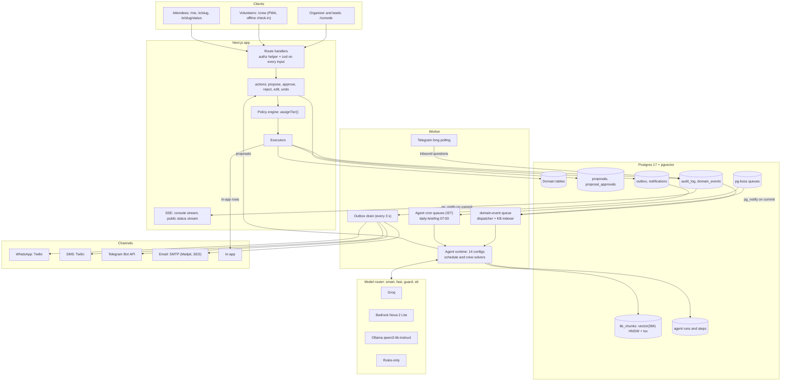
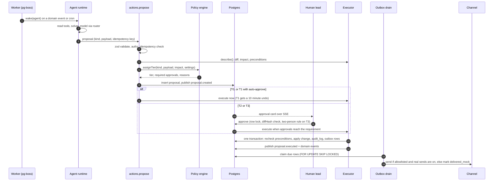
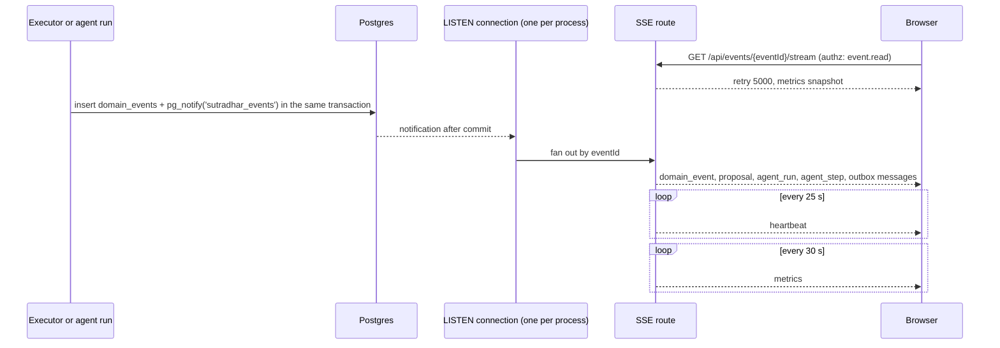
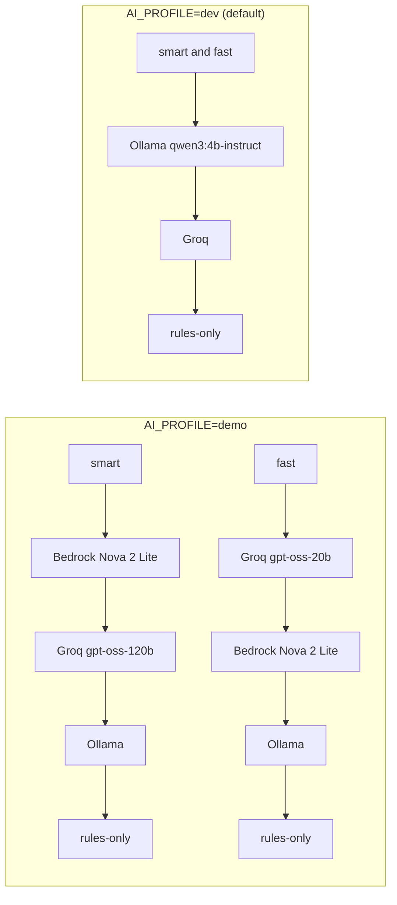

# Architecture

OFFSTAGE is one Next.js app, one Node worker and one Postgres database. Agents never write to domain tables: they call `actions.propose()`, the policy engine assigns a risk tier, humans approve when the tier requires it, and a deterministic executor applies the change in a single transaction.

## System

Key files:

| Piece | Where |
|---|---|
| Agent configs | `src/agents/<name>/config.ts`, registered in `src/agents/index.ts` |
| Agent runtime and wake | `src/agents/runtime/` |
| Proposal lifecycle | `src/server/actions/` (`propose.ts`, `decide.ts`, `execute.ts`, `preconditions.ts`) |
| Executors | `src/server/actions/executors/` |
| Policy engine | `src/server/policy/tiers.ts` |
| Event bus | `src/server/events/bus.ts` (`publish()`, `audit()`) |
| SSE helper | `src/server/sse.ts` |
| Channels | `src/server/channels/` |
| Model router | `src/ai/router/` |
| Guard | `src/ai/guard/` |
| Retrieval | `src/ai/rag/` |
| Worker | `worker/index.ts`, `worker/jobs/` |

## A proposal from agent to message

Guarantees along the way:

- **Idempotency.** `(eventId, idempotencyKey)` is unique; a repeat returns `duplicate`.
- **Impact cannot be understated.** The executor's `describe()` computes impact on the server. An agent may claim more impact, never less.
- **Stale approvals fail safe.** Proposals expire after 30 minutes by default. At execution, precondition versions are rechecked and a mismatch marks the proposal `stale`.
- **All or nothing.** A `plan.bundle` executes every child in the same transaction.
- **Messages are throttled at send time.** Quiet hours 22:00 to 07:00 IST (only a human-approved emergency skips them), a per-person hourly cap, and a 24 hour dedupe hash.
- **Retries.** The outbox drain retries up to 3 times with a growing backoff.

## Live updates over SSE

- Notification channels: `sutradhar_events` (domain events), `sutradhar_runs` (agent runs and steps), `sutradhar_outbox` (delivery updates).
- The public status page uses `GET /api/public/events/{slug}/status/stream`, with no login. It sends a debounced `status` message on session and announcement events, plus a tick every 60 seconds.
- If LISTEN is unavailable, pages fall back to polling the overview endpoint.
- In the showcase build, the same `StreamMessage` objects come from recorded fixtures instead (see [showcase-mode.md](showcase-mode.md)).

## Model router

- **Tiers.** `smart` and `fast` for agents. `guard` is Groq Prompt Guard 2, with regex heuristics first. `stt` is Groq Whisper large v3 turbo.
- **Overrides.** Any tier's chain can be overridden with `AI_CHAIN_<TIER>`. A provider is skipped when it has no credentials, or when Ollama does not answer its probe.
- **Fallback.** A 429, 5xx or timeout opens a 60 second circuit for that provider and the router moves on. A schema failure is retried once with the error, then moves on.
- **Groq rate limits.** A token bucket per model tracks RPM, TPM and tokens per day, so Groq is skipped before it would return a 429.
- **Budgets.** 30,000 tokens per agent run, USD 3 per IST day, and 2 concurrent runs per agent (all configurable). When the daily cap is reached, non-critical agents pause and critical ones continue on Ollama.
- **Untrusted text.** It is screened by the guard, wrapped in randomised `<untrusted-...>` tags, and only ever placed in messages, never in instructions.
